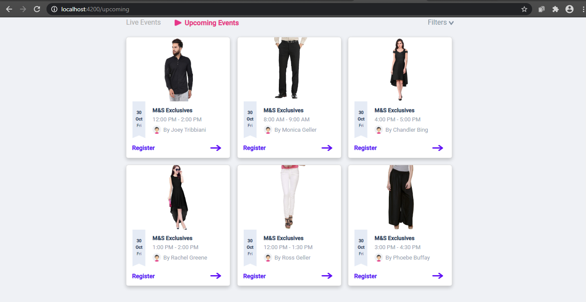

# VideoFrontEnd

This project was generated with [Angular CLI](https://github.com/angular/angular-cli) version 9.1.8.

## Development server
First `npm install`  for installing all the modeules  
Run `ng serve` for a dev server. Navigate to `http://localhost:4200/`. The app will automatically reload if you change any of the source files.

## Build

Run `ng build` to build the project. The build artifacts will be stored in the `dist/` directory. Use the `--prod` flag for a production build.

# Demo

Link:  http://localhost:8344/

## Demo working:
    
    
 
